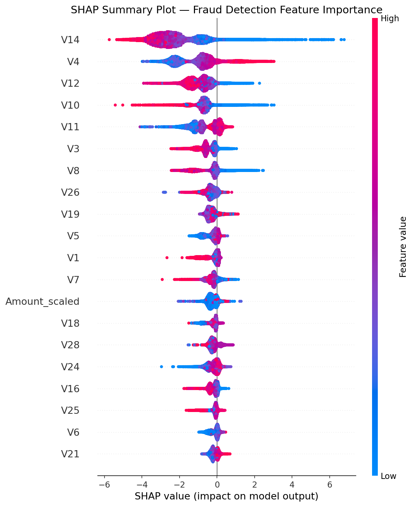
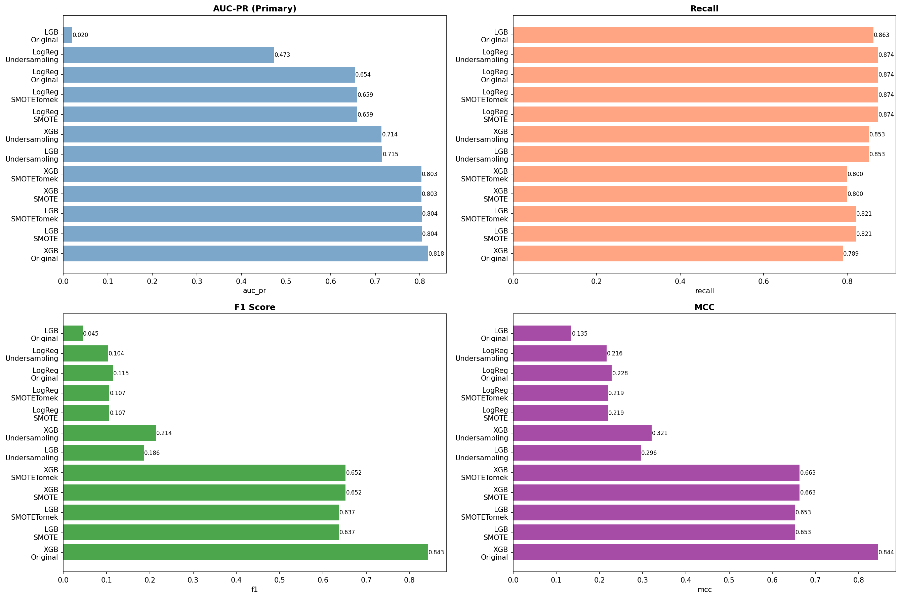
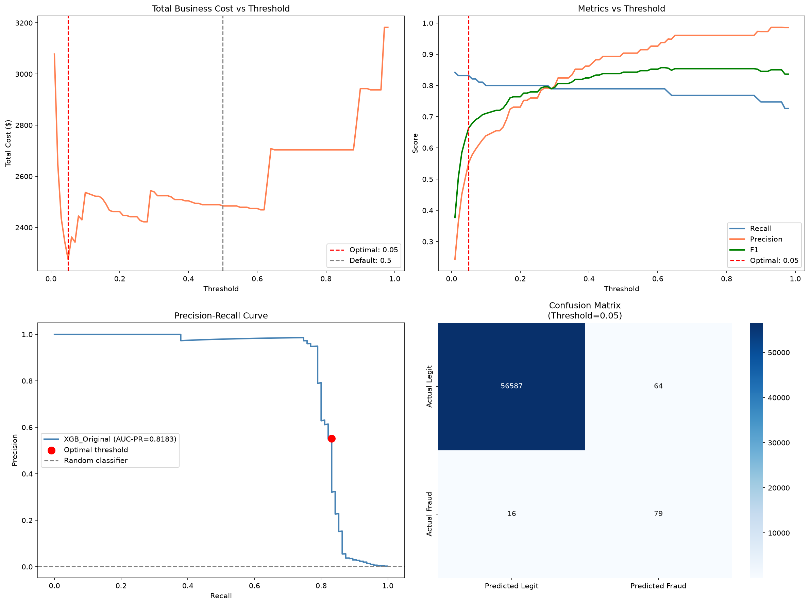

<div align="center">

# Credit Card Fraud Detection

End-to-end fraud detection on a highly imbalanced (0.17% fraud) credit card transaction dataset — sampling strategy, threshold tuning, and metrics chosen for imbalance, not accuracy.

`Python 3.12` `scikit-learn 1.8` `XGBoost 3.2` `LightGBM 4.6` `imbalanced-learn` `SHAP` `MLflow 3.10`

</div>

---

### Contents

- [Overview](#overview)
- [Results](#results)
- [Key findings](#key-findings)
- [Project structure](#project-structure)
- [Tech stack](#tech-stack)
- [How to run](#how-to-run)
- [Key visualizations](#key-visualizations)
- [What I learned](#what-i-learned)

## Overview

The dataset is extremely imbalanced — about 599 legitimate transactions for every 1 fraud case. The project focuses on sampling strategies, decision-threshold tuning, and metrics that actually matter for imbalanced data, rather than accuracy.

## Results

| Model | Recall | Precision | F1 | AUC-PR | AUC-ROC |
|---|---|---|---|---|---|
| **XGBoost (no sampling, class weights)** | **0.7895** | **0.9036** | **0.8427** | **0.8183** | **0.9748** |
| LightGBM (SMOTE) | 0.8211 | 0.5200 | 0.6367 | 0.8040 | 0.9670 |
| XGBoost (SMOTE) | 0.8000 | 0.5507 | 0.6524 | 0.8034 | 0.9698 |

**Best model: XGBoost, no sampling, class weights — AUC-PR 0.8183**

At the default 0.5 threshold this model catches 79% of fraud with 90% precision. After tuning the decision threshold against an estimated business cost (missed fraud vs. false alarms), the optimal threshold of 0.05 catches 83% of fraud and lowers total estimated cost from $2,484 to $2,275 on the test set.

## Key findings

- The dataset is extremely imbalanced — about 599 legitimate transactions for every 1 fraud case
- Class weights on the original data beat every resampling strategy (SMOTE, undersampling, SMOTETomek) on AUC-PR
- Resampling raises recall a little but costs a lot of precision, meaning far more false alarms
- V17, V14, and V3 are the PCA features that separate fraud from legitimate transactions the most
- Tuning the decision threshold against business cost catches more fraud than the default 0.5 threshold, at the cost of more false alarms — worth it here since missed fraud costs far more than a false alarm

## Project structure

```
Credit_Fraud_Detection/
├── notebooks/
│   ├── EDA.ipynb              # Exploratory data analysis
│   ├── preprocessing.ipynb    # Cleaning, feature engineering, sampling
│   ├── modeling.ipynb         # Model training, comparison, threshold tuning
│   └── explainability.ipynb   # SHAP and MLflow tracking
├── results/
│   ├── shap_summary.png              # SHAP feature importance
│   ├── model_comparison.png          # Model comparison chart
│   ├── pr_curve.png                  # Precision-recall curve
│   ├── threshold_analysis.png        # Cost vs threshold analysis
│   ├── correlation_heatmap.png       # Feature correlations
│   └── ...                           # All other plots
├── .gitignore
├── requirements.txt
└── README.md
```

## Tech stack

| Category | Tools |
|---|---|
| Data | `pandas` `numpy` `scipy` |
| Visualization | `matplotlib` `seaborn` |
| ML | `scikit-learn` `XGBoost` `LightGBM` |
| Imbalanced data | `imbalanced-learn` (SMOTE, undersampling, SMOTETomek) |
| Explainability | `SHAP` |
| Tracking | `MLflow` |

## How to run

```bash
# Clone the repo
git clone https://github.com/hossamhamdy333/AI_Portfolio
cd AI_Portfolio/Credit_Fraud_Detection

# Install dependencies
pip install -r requirements.txt

# Download the data from Kaggle
# https://www.kaggle.com/mlg-ulb/creditcardfraud
# place creditcard.csv in a data/ folder in this project

# Run notebooks in order
# 1. EDA.ipynb
# 2. preprocessing.ipynb
# 3. modeling.ipynb
# 4. explainability.ipynb
```

## Key visualizations

**SHAP feature importance**


**Model comparison**


**Threshold analysis**


## What I learned

- AUC-PR is a much more useful metric than accuracy or AUC-ROC at this level of class imbalance
- Resampling is not always the answer — class weights on the original data outperformed every SMOTE variant here
- The right decision threshold depends on the actual cost of a missed fraud vs. a false alarm, not just on the model's metrics
- V14 stands out as important in both the EDA analysis and the SHAP importance, though the two rankings differ beyond that — EDA and SHAP are measuring different things (raw separation vs. actual contribution to the trained model's predictions)
