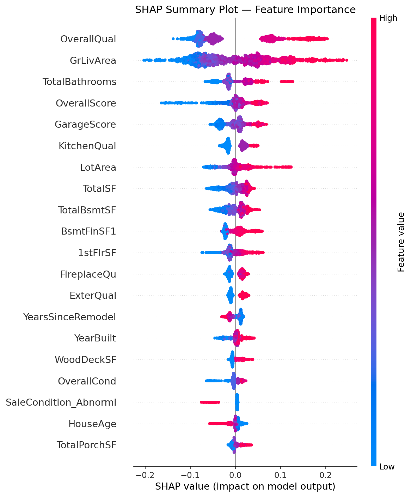
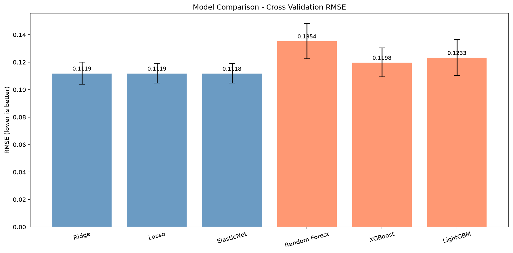

<div align="center">

# House Price Prediction — Advanced Regression

End-to-end regression on the Ames Housing dataset — the complete pipeline from raw data to explainable predictions.

`Python 3.12` `scikit-learn 1.8` `XGBoost 3.2` `LightGBM` `Optuna` `SHAP` `MLflow 3.10`

</div>

---

### Contents

- [Overview](#overview)
- [Results](#results)
- [Key findings](#key-findings)
- [Project structure](#project-structure)
- [Tech stack](#tech-stack)
- [How to run](#how-to-run)
- [Key visualizations](#key-visualizations)
- [What I learned](#what-i-learned)

## Overview

End-to-end machine learning project predicting house prices using the Ames Housing Dataset, covering the complete ML pipeline from raw data to explainable predictions.

## Results

| Model | CV RMSE | Improvement |
|---|---|---|
| Ridge (baseline) | 0.1119 | 0.0% |
| LightGBM (tuned) | 0.1189 | 3.6% |
| XGBoost (tuned) | 0.1148 | 4.9% |
| **Stacking Ensemble** | **0.1104** | **Best** |

**Best model: Stacking Ensemble — RMSE 0.1104** (~11% average error on log-transformed prices)

## Key findings

- **OverallQual** is the strongest predictor (SHAP importance #1)
- **TotalBathrooms** — an engineered feature — outperformed many original features
- Linear models are competitive with tree models on well-engineered tabular data
- Quality premium accelerates sharply above OverallQual = 8

## Project structure

```
House_Price_Prediction/
├── notebooks/
│   ├── EDA.ipynb                     # Exploratory data analysis
│   ├── feature_engineering.ipynb     # Cleaning and feature engineering
│   ├── modeling.ipynb                # Model building and comparison
│   ├── Hyperparameters_Tuning.ipynb  # Optuna tuning and final blend
│   └── explainability.ipynb          # SHAP and MLflow tracking
├── src/
│   └── preprocessing.py            # Reusable preprocessing functions, used by the notebooks
├── results/
│   ├── shap_summary.png            # SHAP feature importance
│   ├── models_comparison.png       # Model comparison chart
│   ├── optuna_history.png          # Tuning optimization history
│   ├── correlation_heatmap.png     # Feature correlations
│   └── ...                         # All other plots
├── data/
│   └── data_description.txt        # Feature documentation
├── .gitignore
├── requirements.txt
└── README.md
```

## Tech stack

| Category | Tools |
|---|---|
| Data | `pandas` `numpy` `scipy` |
| Visualization | `matplotlib` `seaborn` |
| ML | `scikit-learn` `XGBoost` `LightGBM` |
| Explainability | `SHAP` |
| Tracking | `MLflow` |
| Tuning | `Optuna` |

## How to run

```bash
# Clone the repo
git clone https://github.com/hossamhamdy333/AI_Portfolio
cd AI_Portfolio/House_Price_Prediction

# Install dependencies
pip install -r requirements.txt

# Download data from Kaggle
# https://www.kaggle.com/competitions/house-prices-advanced-regression-techniques

# Run notebooks in order
# 1. EDA.ipynb
# 2. feature_engineering.ipynb
# 3. modeling.ipynb
# 4. Hyperparameters_Tuning.ipynb
# 5. explainability.ipynb
```

## Key visualizations

**SHAP feature importance**


**Model comparison**


## What I learned

- Professional EDA reveals insights that intuition misses
- Feature engineering impact: TotalBathrooms correlation 0.673 vs. raw features
- SHAP explainability is essential for trustworthy ML systems
- Hyperparameter tuning with Optuna improved XGBoost by 4.9%
- Linear models with good features compete with gradient boosting
