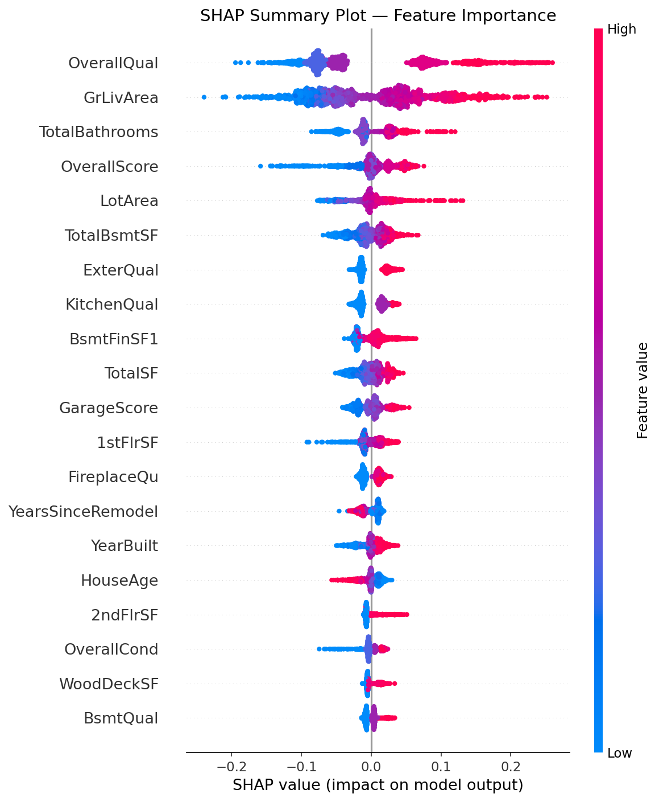

# 🏠 House Price Prediction — Advanced Regression


## 📌 Overview
End-to-end machine learning project predicting house prices
using the Ames Housing Dataset. Covers the complete ML pipeline
from raw data to explainable predictions.

## 🎯 Results

| Model | CV RMSE | Improvement |
|-------|---------|-------------|
| Ridge (baseline) | 0.1119 | — |
| LightGBM (tuned) | 0.1192 | 3.4% |
| XGBoost (tuned) | 0.1140 | 5.5% |
| Stacking Ensemble | 0.1109 | Best |

**Best model: Stacking Ensemble — RMSE 0.1109**
(~11% average error on log-transformed prices)

## 🗂️ Project Structure

```
AI_Portfolio/
└── Project_01_House_Price_Prediction/
    ├── notebooks/
    │   ├── EDA.ipynb                   # Exploratory data analysis
    │   ├── feature_engineering.ipynb   # Cleaning & feature engineering
    │   ├── modeling.ipynb              # Model building & comparison
    │   └── explainability.ipynb        # SHAP + MLflow tracking
    ├── src/
    │   └── preprocessing.py            # Reusable preprocessing functions
    ├── results/
    │   ├── shap_summary.png            # SHAP feature importance
    │   ├── model_comparison.png        # Model comparison chart
    │   ├── optuna_history.png          # Tuning optimization history
    │   ├── correlation_heatmap.png     # Feature correlations
    │   └── ...                         # All other plots
    ├── data/
    │   └── data_description.txt        # Feature documentation
    ├── .gitignore
    ├── requirements.txt
    └── README.md
```

## 🔍 Key Findings

- **OverallQual** is the strongest predictor (SHAP importance #1)
- **TotalBathrooms** — engineered feature — outperformed
  many original features
- Linear models competitive with tree models on
  well-engineered tabular data
- Quality premium accelerates sharply above OverallQual=8

## 🛠️ Tech Stack
- **Data:** Pandas, NumPy, SciPy
- **Visualization:** Matplotlib, Seaborn, Plotly
- **ML:** Scikit-learn, XGBoost, LightGBM
- **Explainability:** SHAP
- **Tracking:** MLflow
- **Tuning:** Optuna

## 🚀 How to Run

```bash
# Clone the repo
git clone https://github.com/hossamhamdy333/AI_Portfolio

# Navigate to project
cd AI_Portfolio/Project_01_House_Price_Prediction

# Install dependencies
pip install -r requirements.txt

# Download data from Kaggle
# https://www.kaggle.com/competitions/house-prices-advanced-regression-techniques

# Run notebooks in order
# 1. EDA.ipynb
# 2. feature_engineering.ipynb
# 3. modeling.ipynb
# 4. explainability.ipynb
```

## 📊 Key Visualizations

### SHAP Feature Importance


### Model Comparison


## 📚 What I Learned
- Professional EDA reveals insights that intuition misses
- Feature engineering impact: TotalBathrooms correlation
  0.673 vs raw features
- SHAP explainability is essential for trustworthy ML systems
- Hyperparameter tuning with Optuna improved XGBoost by 5.5%
- Linear models with good features compete with gradient boosting
