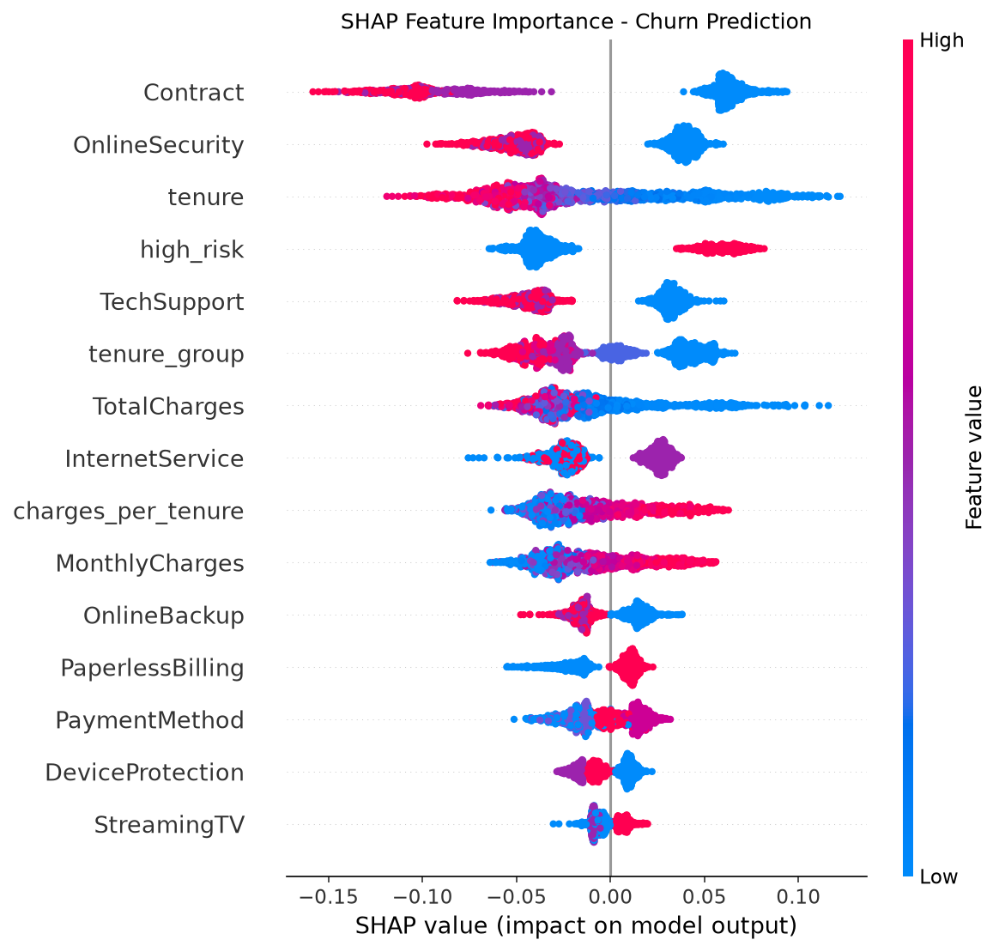
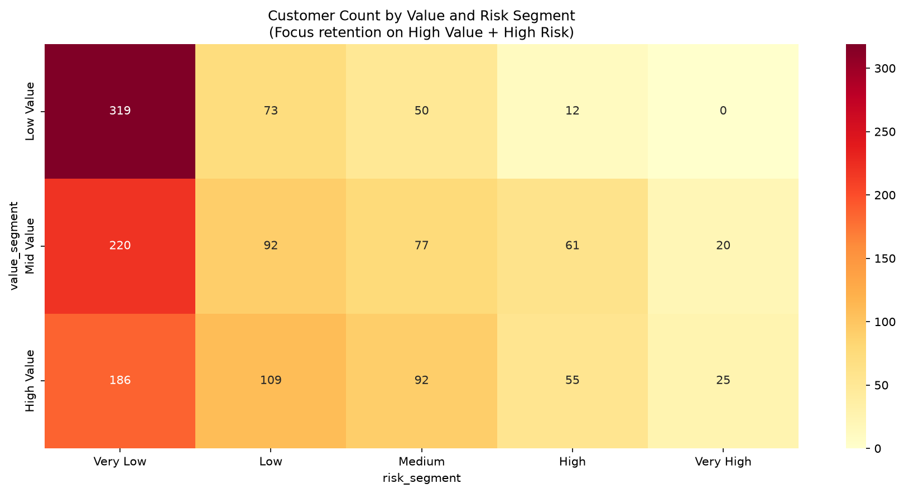

# Customer Churn Prediction


## Overview
End-to-end machine learning project predicting customer churn for a
telecom company, using the Telco Customer Churn dataset. Beyond
picking the best classifier, the project calibrates predicted
probabilities, explains the model with SHAP, and turns the output
into a business decision: which customers are worth a retention
offer, and who to prioritize first.

## Results

| Model | ROC-AUC | AUC-PR | Recall | Precision | F1 | Brier |
|-------|---------|--------|--------|-----------|-----|-------|
| Random Forest | 0.8418 | 0.6544 | 0.7834 | 0.5416 | 0.6404 | 0.1587 |
| Logistic Regression | 0.8387 | 0.6238 | 0.8048 | 0.5050 | 0.6206 | 0.1699 |
| LightGBM | 0.8333 | 0.6418 | 0.7380 | 0.5359 | 0.6209 | 0.1602 |
| XGBoost | 0.8310 | 0.6336 | 0.6925 | 0.5243 | 0.5968 | 0.1585 |

**Best model: Random Forest - ROC-AUC 0.8418**

Random Forest is then calibrated with isotonic regression, fit with
cross validation on the training set only so the test set stays
untouched for evaluation. Calibration brings the Brier score down
from 0.1587 to 0.1363, a 14.1% improvement, meaning the predicted
probabilities can actually be trusted as probabilities, not just
used to rank customers.

## Project Structure

```
customer_churn_prediction/
├── notebooks/
│   ├── EDA_and_Preprocessing.ipynb    # Exploratory analysis, cleaning, feature engineering
│   ├── Modeling_and_Evaluation.ipynb  # Training, calibration, SHAP, profit-based threshold
│   └── Customer_Segmentation.ipynb    # Risk and value segmentation, retention priority matrix
├── results/
│   ├── churn_by_category.png          # Churn rate by categorical feature
│   ├── correlation_heatmap.png        # Feature correlations
│   ├── roc_pr_curves.png              # ROC and precision-recall curves
│   ├── calibration_curves.png         # Calibration before tuning (all four models)
│   ├── after_calibration_curve.png    # Calibration after tuning (best model)
│   ├── threshold_optimization.png     # Profit vs classification threshold
│   ├── shap_summary.png               # SHAP feature importance
│   ├── shap_waterfall.png             # SHAP explanation for one customer
│   ├── priority_matrix.png            # Customer count by value x risk segment
│   └── numerical_analysis.png         # Numerical feature distributions by churn
├── data/                              # not tracked, see below
├── models/                            # not tracked, see below
├── .gitignore
├── requirements.txt
└── README.md
```

## Key Findings

- Overall churn rate is 26.54%
- Contract type, tenure, and lack of add-on services (online
  security, tech support) are the strongest churn signals, both by
  raw correlation in EDA and by SHAP importance on the trained model
- Customers flagged as high risk (month-to-month contract, above
  median monthly charges) churn far more than everyone else, and
  `high_risk` shows up as the 4th most important SHAP feature
- Random Forest has the best ROC-AUC, but Logistic Regression has
  meaningfully higher recall (0.8048 vs 0.7834), which matters if
  the business would rather over-flag than miss a churner
- Raw model probabilities are not well calibrated out of the box,
  isotonic calibration is needed before probabilities can be used
  in a profit calculation. After calibration, predicted probability
  tracks actual churn rate closely across every risk band (see
  segmentation results below)
- The profit-optimal threshold is 0.01, far below the default 0.5.
  This comes from a cost structure where a retained customer is
  worth about 40x more than a wasted retention offer costs, and a
  missed churner costs their entire estimated lifetime value. The
  formula assumes every retention offer succeeds, which pushes the
  threshold aggressively low, so 0.01 is closer to "who to rank
  first" than a literal cutoff to act on for everyone
- Segmenting the test set by risk band shows the calibration holds
  up well: predicted probability tracks actual churn rate closely
  in every band (Very Low: 6.9% predicted vs 7.7% actual, up to
  Very High: 89.0% predicted vs 80.0% actual on a small sample of
  45 customers)
- Crossing risk with customer value narrows the list fast: of 1,409
  test customers, only 80 are both high value and high or very
  high risk, that's the group worth the most immediate, highest
  touch retention effort

## Tech Stack
- **Data:** Pandas, NumPy, SciPy
- **Visualization:** Matplotlib, Seaborn
- **ML:** Scikit-learn, XGBoost, LightGBM
- **Explainability:** SHAP
- **Tracking:** MLflow
- **Model persistence:** joblib

## How to Run

```bash
# Clone the repo
git clone https://github.com/hossamhamdy333/AI_Portfolio

# Navigate to project
cd AI_Portfolio/customer_churn_prediction

# Install dependencies
pip install -r requirements.txt

# Download the data from Kaggle
# https://www.kaggle.com/datasets/blastchar/telco-customer-churn
# place WA_Fn-UseC_-Telco-Customer-Churn.csv in a data/ folder in this project

# Run notebooks in order
# 1. EDA_and_Preprocessing.ipynb
# 2. Modeling_and_Evaluation.ipynb
# 3. Customer_Segmentation.ipynb
```

`data/` and `models/` are not tracked in git, they're created and
filled in by running the notebooks above.

## Key Visualizations

### SHAP Feature Importance


### ROC and Precision-Recall Curves


### Retention Priority Matrix


## What I Learned
- A model with the best ROC-AUC is not automatically the best
  choice, recall, precision, and calibration all matter depending
  on what the predictions are used for
- Calibration has to be fit on data the model has not already been
  evaluated against, doing this wrong is an easy mistake and it
  quietly inflates how good the calibration looks. It's worth
  checking calibration by segment after the fact, not just trusting
  the Brier score on its own
- Turning a classifier into a business decision means translating
  probabilities into an expected profit, and the threshold that
  maximizes profit depends entirely on the cost assumptions behind
  it, an unrealistic assumption (like a guaranteed retention
  success rate) can push the "optimal" threshold to an extreme that
  isn't actually meant to be used at face value
- SHAP is a useful sanity check that a model learned real signal,
  the features it ranks highest here (contract type, tenure, lack
  of support services) match domain intuition about churn, and
  mostly line up with what stood out in EDA
