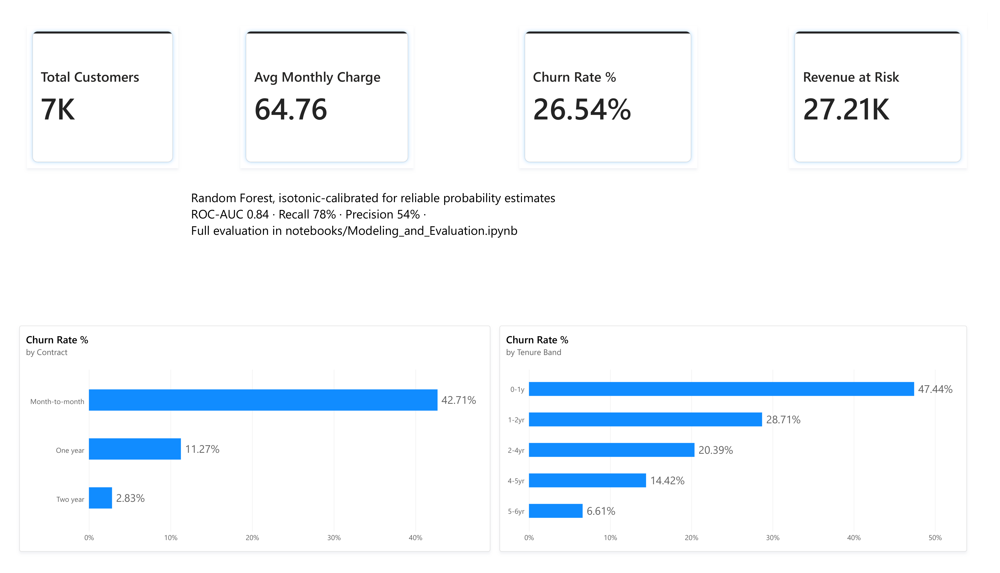
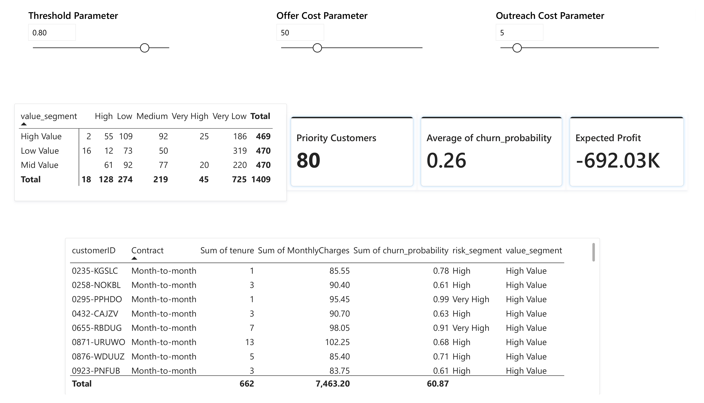

# Customer Churn Prediction — Model, SQL, and Two Dashboards

Predicting churn for a telecom customer base, then turning that model into
something an actual retention team could use: a SQL layer that reproduces
the segmentation independently of Python, a Streamlit app for day-to-day
use, and a Power BI dashboard for stakeholders who live in Excel and
Office, not notebooks.

The modeling work (EDA, four-model comparison, calibration, SHAP,
profit-based thresholding) came first and is untouched by everything
described below. Everything in `sql/`, `dashboard/`, and `reports/` was
built afterward, on top of the model's real output — not a mockup.

## The numbers, up front

- 7,043 customers, 26.54% churn rate
- Best model: Random Forest, isotonic-calibrated — ROC-AUC 0.84, recall
  78%, precision 54%
- Customers on month-to-month contracts churn at 42.7%, vs. 11.3% on
  one-year and 2.8% on two-year contracts
- New customers (0–1 year tenure) churn at 47.4%, dropping to 6.6% by
  year 5–6
- 80 customers are High Value and High/Very High predicted risk — the
  group worth calling this week
- Average customer lifetime value: $2,279.73. Average monthly charge:
  $64.76

Every number above is pulled from an executed notebook cell or a live
query, not estimated.

## What's in here

```
notebooks/
  EDA_and_Preprocessing.ipynb       feature engineering, tenure/charge buckets
  Modeling_and_Evaluation.ipynb     4-model comparison, isotonic calibration,
                                     profit-based threshold optimization
  Customer_Segmentation.ipynb       risk/value priority matrix, exports
                                     scored_test.csv for the layers below

sql/
  01_create_tables_postgres.sql     staging tables matching the real CSV schema
  02_segment_queries_postgres.sql   churn-by-contract/tenure with window
                                     functions, priority matrix rebuilt
                                     independently of the notebook

dashboard/
  streamlit_app.py                  4-page app: churn overview, calibration
                                     curve, priority matrix, profit-threshold
                                     what-if slider
  powerbi/
    churn_dashboard.pbix            2-page Power BI version of the same idea
    images/                         screenshots, since GitHub can't preview .pbix

reports/
  segment_summary.md                plain-language "who to call this week"

results/                            static plots from the notebooks
models/                             calibrated_model.pkl (gitignored — retrain to regenerate)
data/                               raw + processed data (gitignored — see below)
```

## Modeling summary

Four models compared on the same train/test split (80/20, stratified,
`random_state=42`): Logistic Regression, Random Forest, XGBoost, LightGBM.
Random Forest won on ROC-AUC and got carried forward, then calibrated with
isotonic regression (`CalibratedClassifierCV`, 5-fold) so its predicted
probabilities are actually trustworthy, not just good for ranking.
SHAP explains what's driving individual predictions. The threshold used
for classification isn't the default 0.5 — it's chosen by maximizing
expected profit given the cost of a retention offer against the value of
a saved customer, which is a more honest way to pick a threshold than
guessing.

One finding worth calling out rather than hiding: at the cost assumptions
used in the notebook ($50 retention offer, $5 outreach cost, ~$2,280
average customer value), the profit-optimal threshold comes out at 0.01 —
essentially "flag almost everyone." That's not a bug, it's what the math
says when a missed churner costs far more than a wasted outreach attempt.
Whether that's the right call in practice depends on assumptions the
notebook doesn't have — real campaign capacity, actual offer acceptance
rates — which is exactly why the dashboards below expose those knobs
instead of hardcoding the notebook's answer.

## SQL layer

Two things live here: rule-based churn analysis, and an independent
rebuild of the priority matrix.

The rule-based part — churn rate by contract type, by tenure band with a
window function comparing each band to the overall average, and the
`high_risk`/`high_value` flags — is fully reproducible in SQL from the raw
CSV alone, no model needed.

The priority matrix is different: its risk bands come from the calibrated
model's predicted probabilities, which SQL can't generate. So the SQL
takes the model's exported scores as input and does the bucketing math
itself — the same `pd.cut` bin edges, the same value tertiles — as a
genuine cross-check against the notebook's own pandas groupby, not just a
restatement of it. That cross-check caught a real discrepancy during
development: pandas' `pd.cut()` silently drops rows where the predicted
probability is exactly 0.0 (left-exclusive bin by default), so the SQL
version — written with `<=` throughout — keeps a small number of
customers the notebook's own plot quietly excludes. Documented in the SQL
file itself, not swept under the rug.

Written for PostgreSQL/pgAdmin. Load the raw CSV into `customers_raw` and
the notebook's exported `scored_test.csv` into `scored_customers`, then
run the two SQL files in order.

## Streamlit dashboard

```bash
cd dashboard
pip install streamlit
streamlit run streamlit_app.py
```

Four pages: churn overview, the model's calibration curve, the priority
matrix as a sortable/filterable table with a live "call list" view, and a
what-if page where retention offer cost, outreach cost, and customer value
are sliders instead of fixed numbers — so the threshold decision isn't
locked to one notebook's assumptions.

## Power BI dashboard

Two pages, built on the same two CSVs the SQL layer uses.

**Executive Overview** — KPI cards, churn by contract type, churn by
tenure band, model performance callout.



**Retention Priority** — the priority matrix, the filtered call list, and
the same three what-if sliders as the Streamlit app (threshold, offer
cost, outreach cost), feeding a live Expected Profit measure written in
DAX.



Open `dashboard/powerbi/churn_dashboard.pbix` in Power BI Desktop to
explore it interactively — moving the sliders recalculates Expected
Profit in real time, same mechanism as the Streamlit version, different
tool for a different audience.

## Running the whole thing from scratch

1. Get `WA_Fn-UseC_-Telco-Customer-Churn.csv` (Kaggle, Telco Customer
   Churn) into `data/`.
2. Run the three notebooks in order — EDA, Modeling, Segmentation. The
   last one exports `data/scored_test.csv`.
3. Load both CSVs into Postgres and run the two SQL files (see `sql/` for
   details).
4. Run the Streamlit app, or open the `.pbix` in Power BI Desktop.

## Stack

pandas, scikit-learn, XGBoost, LightGBM, SHAP, MLflow · PostgreSQL ·
Streamlit · Power BI

## A note on the data

The raw dataset and trained model aren't committed (see `.gitignore`) —
the Kaggle CSV isn't mine to redistribute, and a retrained
`calibrated_model.pkl` is a couple of notebook cells away, not something
that belongs in git. Everything needed to regenerate both is in
`notebooks/`.
