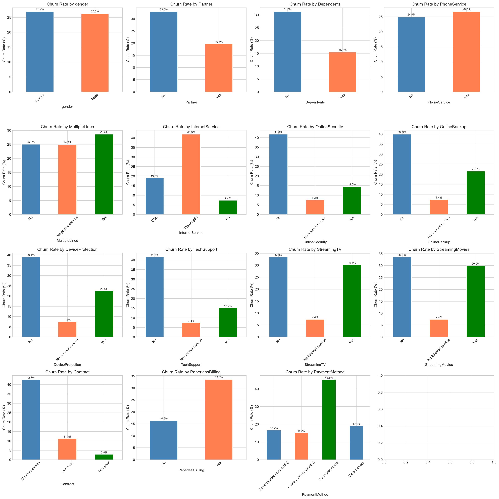
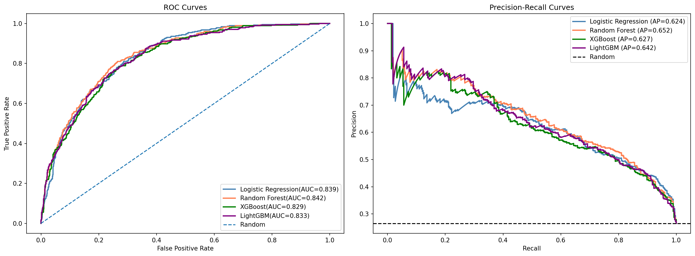
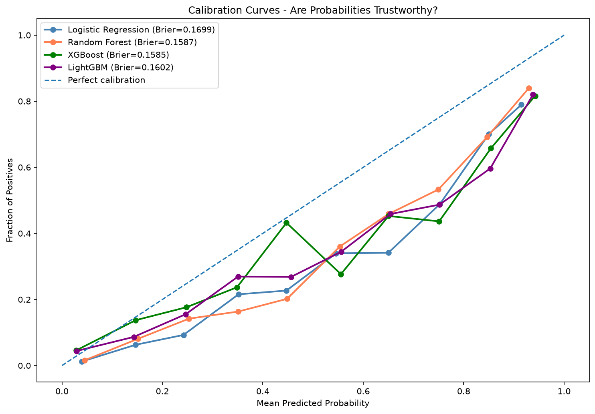

# Customer Churn Prediction


## Overview
End-to-end machine learning project predicting customer churn for a
telecom company, using the Telco Customer Churn dataset. Beyond
picking the best classifier, the project calibrates predicted
probabilities and turns them into a business decision: which
customers are worth a retention offer, based on expected profit
rather than accuracy.

## Results

| Model | ROC-AUC | AUC-PR | Recall | Precision | F1 | Brier |
|-------|---------|--------|--------|-----------|-----|-------|
| Random Forest | 0.8425 | 0.6521 | 0.7460 | 0.5460 | 0.6305 | 0.1524 |
| Logistic Regression | 0.8387 | 0.6238 | 0.8048 | 0.5050 | 0.6206 | 0.1699 |
| LightGBM | 0.8333 | 0.6418 | 0.7380 | 0.5359 | 0.6209 | 0.1602 |
| XGBoost | 0.8290 | 0.6267 | 0.7193 | 0.5479 | 0.6220 | 0.1600 |

**Best model: Random Forest - ROC-AUC 0.8425**

Random Forest is then calibrated with isotonic regression (fit with
cross validation on the training set only) so its predicted
probabilities can be trusted, and used to find the classification
threshold that maximizes expected profit from a retention campaign,
given the cost of a retention offer against the value of a retained
customer.

## Project Structure

```
project_03_customer_churn_prediction/
├── notebooks/
│   ├── EDA_and_Preprocessing.ipynb    # Exploratory analysis, cleaning, feature engineering
│   └── Modeling_and_Evaluation.ipynb  # Model training, calibration, profit-based threshold
├── results/
│   ├── churn_by_category.png          # Churn rate by categorical feature
│   ├── correlation_heatmap.png        # Feature correlations
│   ├── roc_pr_curves.png              # ROC and precision-recall curves
│   ├── calibration_curves.png         # Calibration before tuning
│   ├── after_calibration_curve.png    # Calibration after tuning
│   ├── threshold_optimization.png     # Profit vs classification threshold
│   └── numerical_analysis.png         # Numerical feature distributions by churn
├── .gitignore
├── requirements.txt
└── README.md
```

## Key Findings

- Overall churn rate is 26.54%
- Tenure and contract type are the strongest churn signals, short
  tenure and month-to-month contracts both correlate with churn
- Customers flagged as high risk (month-to-month contract, above
  median monthly charges) churn at 52.8%, against 15.8% for
  everyone else
- Random Forest has the best ROC-AUC, but Logistic Regression has
  meaningfully higher recall, which matters if the business would
  rather over-flag than miss a churner
- Raw model probabilities are not well calibrated out of the box,
  isotonic calibration is needed before the profit calculation can
  be trusted
- The threshold that maximizes profit is well below the default
  0.5, since the cost of losing a customer is much higher than the
  cost of a retention offer

## Note on a Fix

The calibration step originally fit `CalibratedClassifierCV`
directly on the test set, which meant the same data was used to
build the calibrator and then to evaluate it. That has been fixed,
the calibrator is now fit on the training set only, with internal
cross validation, and the test set is used exclusively for the
final evaluation. Because of this fix, the calibration and
threshold-optimization cells need to be re-run to get correct
numbers and plots, the old (leaked) results are not reported here.
`results/calibration_curves.png` (the raw, uncalibrated comparison
across all four models) is unaffected and still valid.
`after_calibration_curve.png` and `threshold_optimization.png` are
downstream of the leaked calibration step specifically and will be
replaced once the notebook is re-run.

## Tech Stack
- **Data:** Pandas, NumPy, SciPy
- **Visualization:** Matplotlib, Seaborn
- **ML:** Scikit-learn, XGBoost, LightGBM
- **Tracking:** MLflow
- **Model persistence:** joblib

## How to Run

```bash
# Clone the repo
git clone https://github.com/hossamhamdy333/AI_Portfolio

# Navigate to project
cd AI_Portfolio/project_03_customer_churn_prediction

# Install dependencies
pip install -r requirements.txt

# Download the data from Kaggle
# https://www.kaggle.com/datasets/blastchar/telco-customer-churn
# place WA_Fn-UseC_-Telco-Customer-Churn.csv in a data/ folder in this project

# Run notebooks in order
# 1. EDA_and_Preprocessing.ipynb
# 2. Modeling_and_Evaluation.ipynb
```

## Key Visualizations

### Churn Rate by Category


### ROC and Precision-Recall Curves


### Calibration Curves (raw models, before tuning)


## What I Learned
- A model with the best ROC-AUC is not automatically the best
  choice, recall, precision, and calibration all matter depending
  on what the predictions are used for
- Calibration has to be fit on data the model has not already been
  evaluated against, doing this wrong is an easy mistake and it
  quietly inflates how good the calibration looks
- Turning a classifier into a business decision means translating
  probabilities into an expected profit, and the threshold that
  maximizes profit is often nowhere near 0.5
