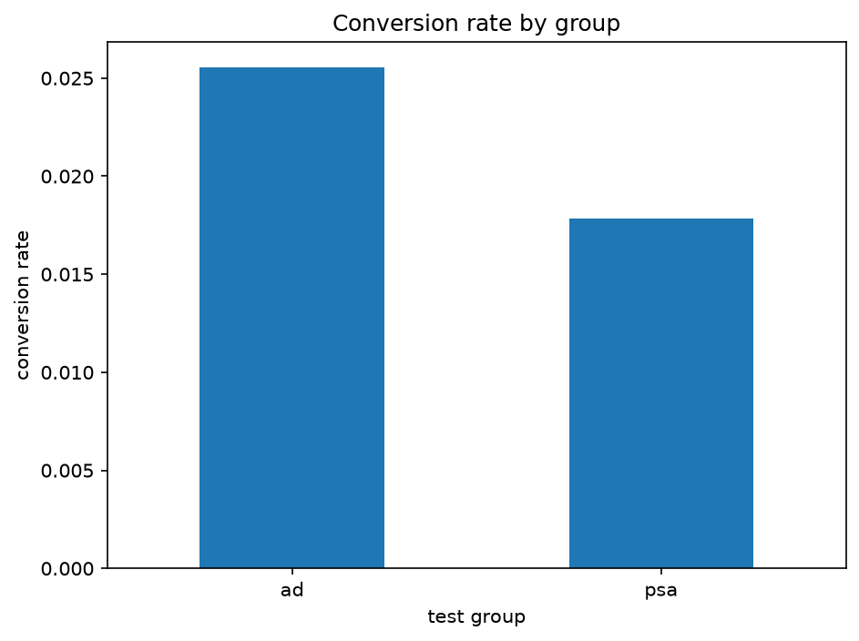
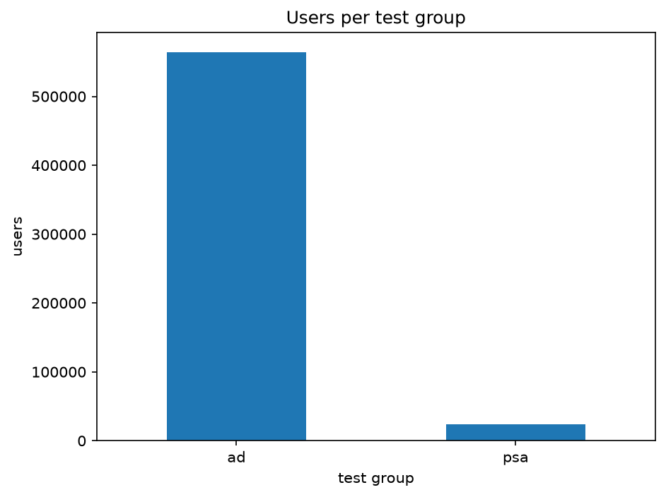
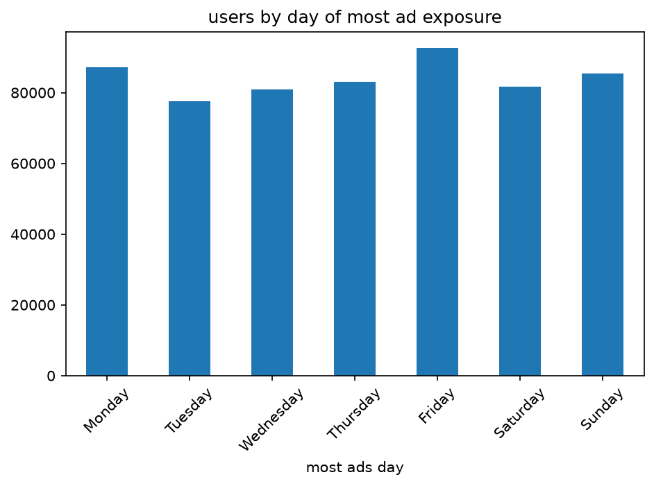
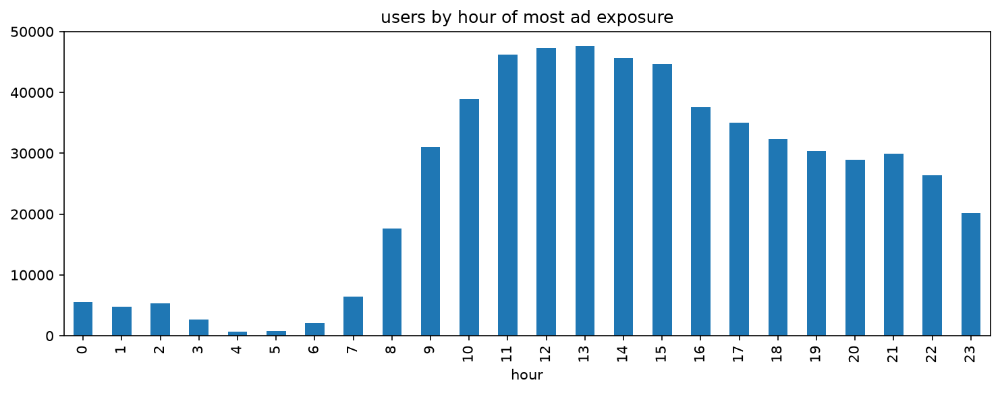

# Marketing Campaign & A/B Test Analytics

**Does showing ads actually change conversion rate — and does the campaign pay for itself?**

An end-to-end analysis of the Kaggle "Marketing A/B Testing" dataset (588,101 users), comparing an `ad` group (shown the campaign) against a `psa` control group (shown a public service announcement instead).

**Stack:** Python · pandas · statsmodels · DuckDB · Streamlit

---

## Summary

The ads work, but they don't pay for themselves.

| | |
|---|---|
| Lift | Conversion rate up 0.77 pp (2.55% vs 1.79%) |
| Significance | p = 1.7e-13, full statistical power |
| Effect size | Small (Cohen's h = 0.053) |
| ROI | 0.39x under stated cost/revenue assumptions — the campaign lost money |

Full writeup with all caveats: [`reports/ab_test_summary.md`](reports/ab_test_summary.md)

---

## Table of Contents

- [Project layout](#project-layout)
- [Results at a glance](#results-at-a-glance)
- [Method](#method)
- [Tested before trusting it on real data](#tested-before-trusting-it-on-real-data)
- [Running it](#running-it)
- [Key findings](#key-findings)

---

## Project layout

| Path | What it does |
|---|---|
| `sql/01_campaign_summary.sql` | Conversion rate by group / day / hour, written in DuckDB SQL |
| `sql/run_summary.py` | Runs the SQL file above and prints the results |
| `notebooks/01_eda.ipynb` | Group balance, conversion funnel, ad exposure and timing |
| `notebooks/02_ab_test_analysis.ipynb` | Two-proportion z-test, confidence interval, effect size (Cohen's h), power analysis |
| `notebooks/03_campaign_roi.ipynb` | Cost/revenue assumptions to ROI, with a sensitivity table |
| `dashboard/streamlit_app.py` | Interactive version: funnel, significance test, ROI sliders |
| `reports/ab_test_summary.md` | The final writeup, with real numbers |
| `tests/` | Checks the stats logic against synthetic data before trusting it on the real dataset |

---

## Results at a glance

<table>
<tr>
<td width="50%">

**Conversion rate by group**



</td>
<td width="50%">

**Group balance (96% ad / 4% psa)**



</td>
</tr>
<tr>
<td width="50%">

**Conversion by day of week**



</td>
<td width="50%">

**Conversion by hour of day**



</td>
</tr>
</table>

---

## Method

Conversion is binary and compared between two independent groups — that calls for a two-proportion z-test, not a t-test (t-tests compare means of continuous data, not proportions). The notebook reports:

- p-value
- 95% confidence interval on the difference
- Cohen's h as effect size
- Power analysis

The power analysis matters because at this sample size, even a small, practically unimportant difference can come back statistically significant — effect size and power are what tell you whether that's actually happened here.

**Group imbalance:** the split is 96% ad / 4% psa, flagged directly in the EDA notebook. It doesn't invalidate the test, but it does make the smaller group's conversion-rate estimate noisier — visible in the dashboard's confidence-interval chart, where the psa interval is noticeably wider than the ad interval.

---

## Tested before trusting it on real data

A project like this can look right and still hide a subtle bug — a one-tailed test mislabeled as two-tailed, a t-test used on binary data, an underpowered sample mistaken for "no effect." So the core stats logic is validated against three synthetic scenarios before it ever touches the real dataset:

| Scenario | Setup | Expected result |
|---|---|---|
| `real_effect` | Clear, real gap between groups | Significant |
| `no_effect` | Both groups convert at the same true rate | Not significant |
| `borderline` | Tiny true gap | Could go either way — this is where power matters: a "not significant" result here should come with a low power reading, not get misread as "no effect exists" |

The dashboard is checked with Streamlit's `AppTest`, and the SQL runs against a fixture through DuckDB before ever touching the real CSV.

---

## Running it

**1. Install dependencies**

```bash
pip install -r requirements.txt
```

**2. Get the data**

Download the real dataset from Kaggle ("Marketing A/B Testing" by faviovaz) and place it at:

```
data/raw/marketing_AB.csv
```

**3. Run the notebooks, in order**

```
01_eda.ipynb -> 02_ab_test_analysis.ipynb -> 03_campaign_roi.ipynb
```

**4. Run the SQL summary**

```bash
cd sql
python run_summary.py
```

**5. Launch the dashboard**

```bash
cd dashboard
streamlit run streamlit_app.py
```

**6. Run the tests** (optional, but they're there)

```bash
cd tests
python test_ab_analysis.py
python test_dashboard.py
```

---

## Key findings

| # | Finding |
|---|---|
| 1 | Ad conversion rate: 2.55% (n=564,577). PSA (control): 1.79% (n=23,524) |
| 2 | Difference is statistically significant (p = 1.7e-13) with full power, but the effect size is small (Cohen's h = 0.053) |
| 3 | Under $0.02/impression and $25/conversion, the campaign generated $108,574.55 in incremental revenue against $280,294.02 in cost — ROI of 0.39x. It lost money at these assumptions |
| 4 | The top 1% of ad-exposed users account for 13.2% of total ad spend — cost is concentrated in a small segment of heavy-exposure accounts, not spread evenly |
| 5 | Conversion rate follows a weekday pattern (higher Monday, lower Saturday) in both groups — a general user-behavior pattern, not something specific to the ad campaign |

Full detail, caveats, and the sensitivity table across other cost/revenue assumptions live in [`reports/ab_test_summary.md`](reports/ab_test_summary.md).
